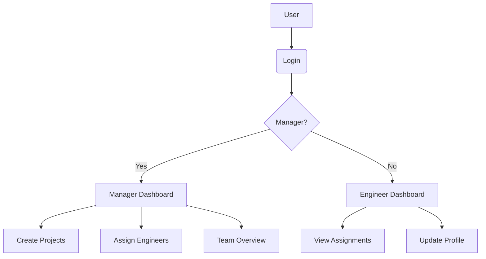
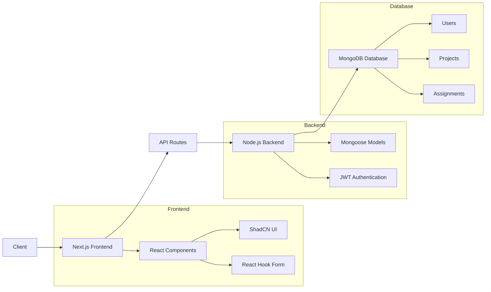
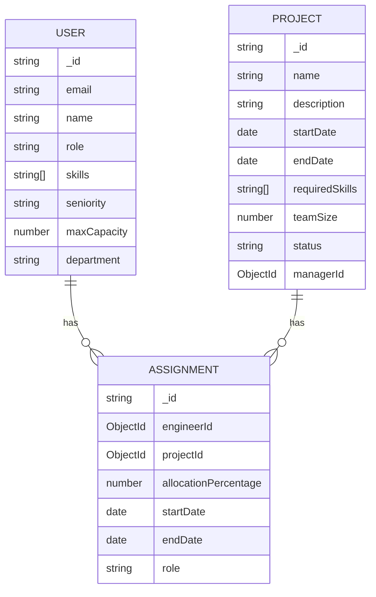

## Directory Structure

```
/erms/
├── .env.local
├── next.config.js
├── package.json
├── tsconfig.json
├── lib/
│   ├── db.ts
│   └── auth.ts
├── models/
│   ├── User.ts
│   ├── Project.ts
│   └── Assignment.ts
├── seed/
│   └── seed-data.ts
├── app/
│   ├── layout.tsx
│   ├── page.tsx
│   ├── auth/
│   │   └── login/
│   │       └── page.tsx
│   ├── dashboard/
│   │   ├── layout.tsx
│   │   ├── page.tsx
│   │   ├── manager/
│   │   │   ├── page.tsx
│   │   │   ├── assignments/
│   │   │   │   └── page.tsx
│   │   │   └── projects/
│   │   │       └── page.tsx
│   │   └── engineer/
│   │       ├── page.tsx
│   │       └── profile/
│   │           └── page.tsx
│   └── api/
│       ├── auth/
│       │   └── route.ts
│       ├── engineers/
│       │   └── route.ts
│       ├── projects/
│       │   └── route.ts
│       └── assignments/
│           └── route.ts
├── components/
│   ├── auth/
│   │   └── LoginForm.tsx
│   ├── dashboard/
│   │   ├── Sidebar.tsx
│   │   ├── CapacityBar.tsx
│   │   ├── SkillTags.tsx
│   │   ├── AssignmentsTable.tsx
│   │   ├── ProjectsTable.tsx
│   │   └── CreateAssignmentForm.tsx
│   └── ui/
│       └── ProtectedRoute.tsx
├── context/
│   └── AuthContext.tsx
└── styles/
    └── globals.css
```

# Engineering Resource Management System

## Setup

1. Clone repository
2. Install dependencies: `npm install`
3. Set up MongoDB locally or via Atlas
4. Create `.env.local` file with:

MONGODB_URI="your_mongodb_connection_string"
JWT_SECRET="your_secure_jwt_secret"

5. Seed database: `npm run seed`
6. Run development server: `npm run dev`

## Features

- Manager dashboard: Team overview, project management
- Engineer dashboard: Assignment tracking
- Capacity allocation with visual indicators
- Skill-based resource assignment

## AI Usage

- Used GitHub Copilot for boilerplate code generation
- Used ChatGPT for complex component design suggestions
- Validated all AI-generated code through manual testing

# Engineering Resource Management System (ERMS)


ERMS is a full-stack application designed to help engineering managers track team assignments, capacity allocation, and project resource planning.

## Table of Contents

1. [System Overview](#system-overview)
2. [Architecture Diagram](#architecture-diagram)
3. [Features](#features)
4. [Tech Stack](#tech-stack)
5. [Installation Guide](#installation-guide)
6. [Database Schema](#database-schema)
7. [API Documentation](#api-documentation)
8. [AI Usage Documentation](#ai-usage-documentation)
9. [Screenshots](#screenshots)
10. [Future Enhancements](#future-enhancements)

## System Overview <a name="system-overview"></a>

ERMS provides a comprehensive solution for managing engineering resources across multiple projects. The system includes:

- 👤 **User Authentication** with JWT tokens
- 👔 **Role-based Access Control** (Manager/Engineer)
- 🧑‍💻 **Engineer Management** with skill tracking
- 📊 **Project Management** with required skills
- ⚖️ **Assignment System** with capacity allocation
- 📈 **Dashboard Views** for resource utilization



## Architecture Diagram <a name="architecture-diagram"></a>



## Features <a name="features"></a>

### Core Functionality

- ✅ User authentication with JWT
- ✅ Role-based access control
- ✅ Engineer profile management
- ✅ Project creation and tracking
- ✅ Resource assignment with capacity allocation
- ✅ Dashboard visualization of team utilization

### Manager Capabilities

- 👁️ View team overview with capacity indicators
- ➕ Create new projects and assignments
- 🔍 Search engineers by skills
- 📊 View team utilization analytics

### Engineer Capabilities

- 👁️ View current assignments
- 📅 See upcoming projects
- ✏️ Update personal profile and skills
- 📊 View personal capacity allocation

## Tech Stack <a name="tech-stack"></a>

### Frontend

- **Framework**: Next.js 14
- **UI Library**: ShadCN UI
- **Styling**: Tailwind CSS
- **Form Management**: React Hook Form + Zod
- **State Management**: React Context API

### Backend

- **Runtime**: Node.js
- **Framework**: Next.js API Routes
- **Database**: MongoDB
- **ODM**: Mongoose
- **Authentication**: JWT

### Development Tools

- **Version Control**: Git
- **Package Manager**: npm
- **AI Tools**: GitHub Copilot, ChatGPT
- **Code Quality**: ESLint, Prettier

## Installation Guide <a name="installation-guide"></a>

### Prerequisites

- Node.js v18+
- MongoDB (local or cloud)
- npm v9+

### Setup Instructions

1. Clone the repository:

   ```bash
   git clone https://github.com/yourusername/erms.git
   cd erms
   ```

2. Install dependencies:

   ```bash
   npm install
   ```

3. Create environment file:

   ```bash
   cp .env.example .env.local
   ```

   Edit `.env.local` with your MongoDB URI and JWT secret

4. Seed the database:

   ```bash
   npm run seed
   ```

5. Start the development server:

   ```bash
   npm run dev
   ```

6. Access the application at:
   ```
   http://localhost:3000
   ```

### Default Accounts

- **Manager**:
  - Email: `manager@example.com`
  - Password: `manager123`
- **Engineer**:
  - Email: `engineer1@example.com`
  - Password: `engineer1`

## Database Schema <a name="database-schema"></a>



## API Documentation <a name="api-documentation"></a>

### Authentication

| Endpoint            | Method | Description           |
| ------------------- | ------ | --------------------- |
| `/api/auth/login`   | POST   | User login            |
| `/api/auth/signup`  | POST   | User registration     |
| `/api/auth/logout`  | POST   | User logout           |
| `/api/auth/profile` | GET    | Get current user data |

### Engineers

| Endpoint                      | Method | Description                     |
| ----------------------------- | ------ | ------------------------------- |
| `/api/engineers`              | GET    | Get all engineers               |
| `/api/engineers/:id/capacity` | GET    | Get engineer's capacity details |

### Projects

| Endpoint            | Method | Description        |
| ------------------- | ------ | ------------------ |
| `/api/projects`     | GET    | Get all projects   |
| `/api/projects`     | POST   | Create new project |
| `/api/projects/:id` | GET    | Get project by ID  |

### Assignments

| Endpoint               | Method | Description           |
| ---------------------- | ------ | --------------------- |
| `/api/assignments`     | GET    | Get all assignments   |
| `/api/assignments`     | POST   | Create new assignment |
| `/api/assignments/:id` | PUT    | Update assignment     |
| `/api/assignments/:id` | DELETE | Delete assignment     |

## AI Usage Documentation <a name="ai-usage-documentation"></a>

### AI Tools Used

- **GitHub Copilot**: Used for boilerplate code generation and code suggestions
- **ChatGPT**: Used for complex component design and algorithm implementation
- **Cursor AI**: Used for code refactoring and optimization

### AI Implementation Examples

1. **Component Generation**:

   - Used GitHub Copilot to generate initial versions of form components
   - Prompt: "Create a React form with validation using react-hook-form and zod"

2. **Algorithm Implementation**:

   - Used ChatGPT to implement the capacity calculation algorithm
   - Prompt: "Implement a function to calculate engineer's available capacity based on active assignments"

3. **Code Optimization**:
   - Used Cursor AI to refactor database query logic
   - Prompt: "Optimize MongoDB queries for better performance"

### Challenges and Solutions

1. **Challenge**: AI-generated code sometimes produced inefficient MongoDB queries

   - **Solution**: Manually reviewed and optimized all database queries

2. **Challenge**: AI suggestions for complex state management were sometimes over-engineered

   - **Solution**: Simplified state management using React Context instead of suggested Redux implementation

3. **Challenge**: AI-generated form components had accessibility issues
   - **Solution**: Manually tested and improved accessibility of all form elements

### Validation Process

- All AI-generated code was manually reviewed and tested
- Business logic was validated with sample test cases
- Edge cases were identified and handled manually
- Integration tests were written for critical components

## Screenshots <a name="screenshots"></a>

### Manager Dashboard


### Engineer Assignments


### Project Creation


## Future Enhancements <a name="future-enhancements"></a>

### Planned Features

- 🗓️ Timeline view for assignments
- 📊 Skill gap analysis
- 🔔 Notification system
- 📈 Advanced analytics dashboard
- 🔄 Real-time updates with WebSockets

### Technical Improvements

- 🧪 Comprehensive test suite (Jest + React Testing Library)
- 🚀 Deployment pipeline (CI/CD)
- 🔒 Enhanced security measures
- 📱 Mobile-responsive design improvements
- 🌐 Internationalization support

---

**ERMS** © 2023 - Engineering Resource Management System | [MIT License](LICENSE)
# engineering-resource-management
